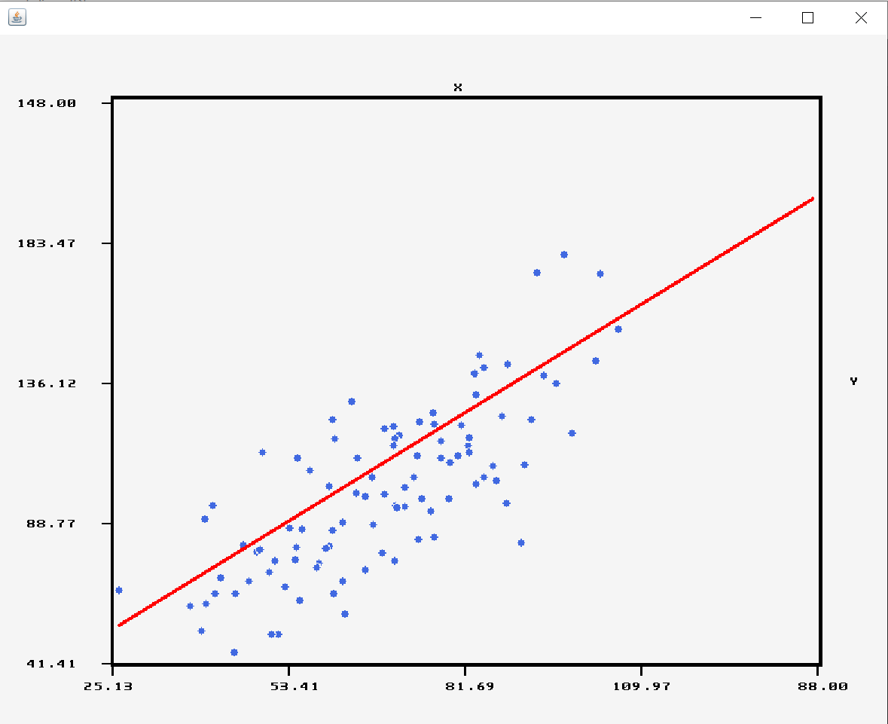
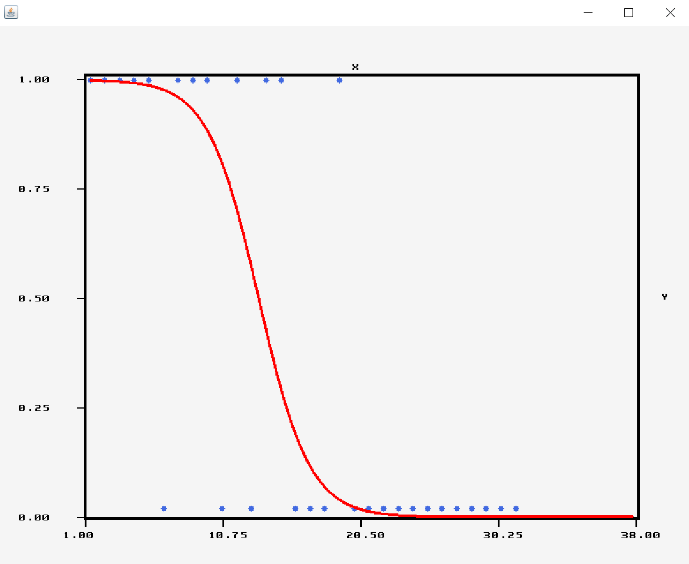
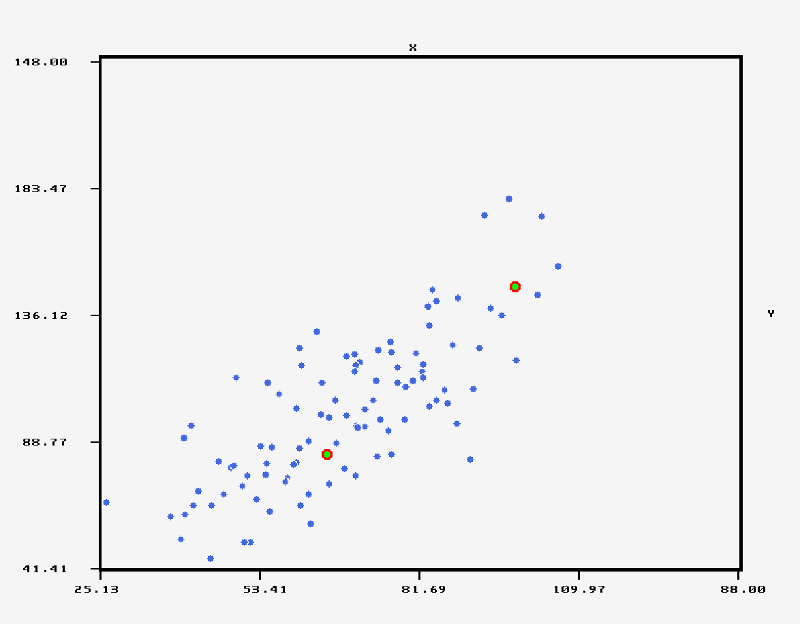

[![Contributors][contributors-shield]][contributors-url]
[![Forks][forks-shield]][forks-url]
[![Stargazers][stars-shield]][stars-url]
[![Issues][issues-shield]][issues-url]
[![MIT License][license-shield]][license-url]
[![LinkedIn][linkedin-shield]][linkedin-url]

<!-- PROJECT LOGO -->
 

  

  <h3 align="center">Java Brain Library</h3>

  

    Simple Solution For Fast Programing Of Data Mining ,Deep Learning And Machine Learning Models As Well As CSV Management.
     
    <a href="https://github.com/MuteJester/Java_Brain"><strong>Explore the docs »</strong></a>
     
     
    <a href="https://github.com/MuteJester/Java_Brain">View Demo</a>
    ·
    <a href="https://github.com/MuteJester/Java_Brain/issues">Report Bug</a>
    ·
    <a href="https://github.com/MuteJester/Java_Brain/issues">Request Feature</a>
  

<!-- TABLE OF CONTENTS -->
## Table of Contents

* [About the Project](#about-the-project)
* [Usage](#usage)
* [Roadmap](#roadmap)
* [Contributing](#contributing)
* [License](#license)
* [Contact](#contact)

<!-- ABOUT THE PROJECT -->
## About The Project
There are a few Deep Learning And Machine Learning Java libraries out there, but none of them in my mind were simple enough to use and required the user to install loads of additional parts trough maven and etc.
At that moment the idea to create a simple plug and play java classes which can be simply dragged into the src folder of any project and functionality of all the tools that the Java Brain library can be quickly and easily accesd and used.

Here's Why Java Brain :brain: :
* It As Simple As Drag And Drop and you are ready to code!
* Function and methods are named meaningful names that way it is always clear what are the parameters or what does the method do!
* CSV handling is all included in the library working with them made much more easier trough java code!

### Built With
* [Eclipse](https://www.eclipse.org/)
* [Inetlij](https://www.jetbrains.com/)
* [SIPL Image Proccesing Library](https://github.com/MuteJester/Simple_Image_Processing_Library)

### Installation
1. Download Both Java Classes(Image and Java_Brain) From The Repository [Go To Repository Folder](https://github.com/MuteJester/Java_Brain/tree/master/Java_Brain)
2. Copy Both Classes Into Your Projects /src Folder
3. Your Are Ready To Code!

<!-- USAGE EXAMPLES -->
## Usage

_Ploting Linear Regression Algorithm_

Java Brain Offers Binary Linear Regression As Well As Multivariable Linear Regression
in the following exmaple a fast method for immediate ploting of a linear regression model.

_Ploting Logistic Regression Algorithm_

Java Brain Offers Binary Logsitic Regression As Well As Multivariable Logistic Regression
in the following exmaple a fast method for immediate ploting of a logistic regression model.
the logistic regression functionality as well as the linear regression can be used as pleased
the methods return the weights resulting after computing the optimal state using gradient descent;

_Ploting 2D K-Means Algorithm_

Java Brain Offers a fast and efficenet K-means calculation aglorithm although currently only up to 3 dimensional K - Means
calculations supported soon there will a higher dimension support system.

### Currently Supported Data Mining / Machine Learning / Deep Learning, Algorithms
  * Linear Regression using Static Formula (Only supported for single variable linear regression)
  * Linear Regression using Gradient Descent (Multivariable regression supported using matrix with Lasso Regression and L1 Regularization)
  * Logistic Regression of binary variable as well as multivariable equations
  * Validation Of Logistic Regression - Confusion Matrix
  * K-Means calculation (up to 3 dimensional data variables)
  * Fully Connected Neural Network contracting class accepting all forms of network topologies for dynamic use
  * Statistical error computations like MSE,R^2,Adj-R^2,Pearsons -  for most models
  * Some of the models have a supported validation methods which will automaticly compare machine guesses against actual values
  
  
  ### Currently Supported CSV Handling Functionality
  
  * Reading/Writing CSV Files
  * Single Block/Column/Row Manipulations
  * Removal and Addition of columns and rows
  * Pattern Replacment
  * Pulling and pushing values into csv stated position
  * CSV spliting by percentage into seperate data sets
  * Column Calculations such as - Column Mean,Column Median,Column Standard Deviation and Column Variance
  
  
  
  ### All Visual Elements Are Created Using The SIPL Library
  
 

_For more Detailed Instructions, please refer to the [User Instructions](https://github.com/MuteJester/Java_Brain/wiki/User-Manual)_

<!-- ROADMAP -->
## Roadmap

See the [open issues](https://github.com/MuteJester/Java_Brain/issues) for a list of proposed features (and known issues).

<!-- CONTRIBUTING -->
## Contributing

Contributions are what make the open source community such a powerfull place to create new ideas, inspire, and make progress. Any contributions you make are **greatly appreciated**.

1. Fork the Project
2. Create your Feature Branch (`git checkout -b feature/AmazingFeature`)
3. Commit your Changes (`git commit -m 'Add some AmazingFeature'`)
4. Push to the Branch (`git push origin feature/AmazingFeature`)
5. Open a Pull Request

<!-- LICENSE -->
## License

Distributed under the MIT License. See `LICENSE` for more information.

<!-- CONTACT -->
## Contact

[Thomas Konstantinovsky]() - thomaskon90@gmail.com

Project Link: [https://github.com/MuteJester/Java_Brain](https://github.com/MuteJester/Java_Brain)

<!-- MARKDOWN LINKS & IMAGES -->
[contributors-shield]: https://img.shields.io/github/contributors/othneildrew/Best-README-Template.svg?style=flat-square
[contributors-url]: https://github.com/othneildrew/Best-README-Template/graphs/contributors
[forks-shield]: https://img.shields.io/github/forks/othneildrew/Best-README-Template.svg?style=flat-square
[forks-url]: https://github.com/othneildrew/Best-README-Template/network/members
[stars-shield]: https://img.shields.io/github/stars/othneildrew/Best-README-Template.svg?style=flat-square
[stars-url]: https://github.com/othneildrew/Best-README-Template/stargazers
[issues-shield]: https://img.shields.io/github/issues/othneildrew/Best-README-Template.svg?style=flat-square
[issues-url]: https://github.com/MuteJester/Java_Brain/issues
[license-shield]: https://img.shields.io/github/license/othneildrew/Best-README-Template.svg?style=flat-square
[license-url]: https://github.com/MuteJester/Java_Brain/blob/master/LICENSE
[linkedin-shield]: https://img.shields.io/badge/-LinkedIn-black.svg?style=flat-square&logo=linkedin&colorB=555
[linkedin-url]: https://www.linkedin.com/in/thomas-konstantinovsky-56230117b/
